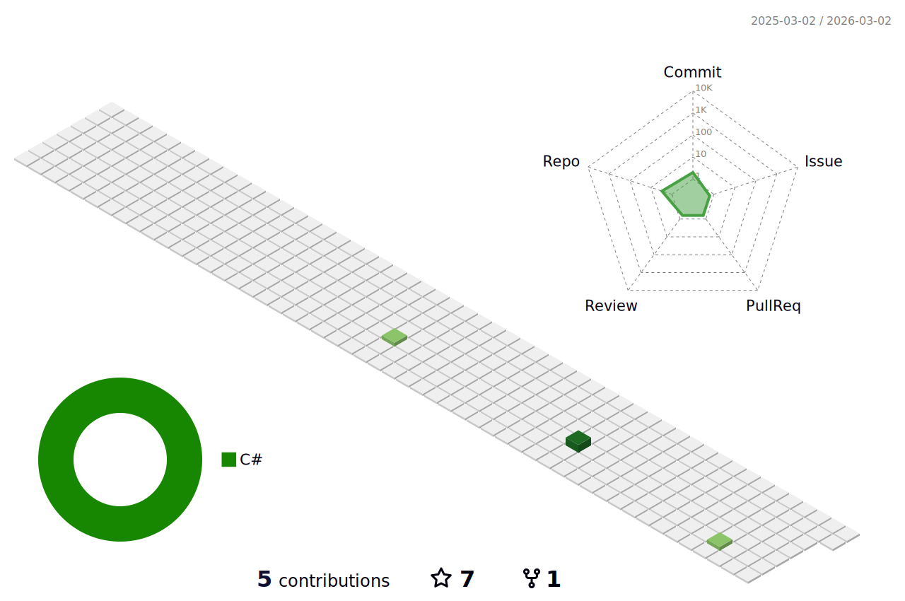

<!-- Heading -->
<h3 align="center">
   
  Hi there!
</h3>

---
 <!-- About section -->
I'm Sky Chen, a creative developer passionate about C#, DevOps and Agile.

I currently work as a Software Engineer at Chailease on maintaining [zingala](https://www.zingala.com/) (BNPL).

Any questions, or want to get involved, please get in touch. Thanks for visiting!

### Connect with me 
  

    
    
    
    
  

 <!-- Conecct section: END -->
 
  <!-- GitHub section -->

<!-- ### Blog & Writing -->

<!-- Apart from coding, I also maintain a blog - you can find my articles on my website at [martinheinz.dev](https://martinheinz.dev/) as well as on [Medium](https://medium.com/@martin.heinz) and [DEV.to](https://dev.to/martinheinz). -->

<!-- A sample of my recent articles: -->
### Blog posts
<!-- BLOG-POST-LIST:START -->
- [[FrontEnd]輕鬆打造漂亮表單：從Element到Style的實用技巧](https://Vincent3054.github.io/post/notes/formelementandformstyle/)
- [[Azure]Azure Blob Storage介紹及案例](https://Vincent3054.github.io/post/notes/csharp-generic-type-constraint/)
- [[AI]NijiJourney：史上最強的二次元 AI 繪圖工具](https://Vincent3054.github.io/post/10minute/nijijourney-ai-artist/)
- [[AI]MidJourney：如何用AI繪圖在10分鐘內創造出令人驚豔的作品](https://Vincent3054.github.io/post/10minute/midjourney-ai-artist/)
- [[AI]Bing Image Creator：微軟推出全新免費AI繪圖工具](https://Vincent3054.github.io/post/10minute/ai-bing-image-creator/)
<!-- BLOG-POST-LIST:END \-->

 ###  My GitHub Stats
 

**Expand to view**

  
<b>⚡ GitHub Profile Stat</b>

  
   
    
   

  
<b>⚡ Recent GitHub Activity</b>

    

   

<!-- GitHub section: END -->

<!-- THE END -->
