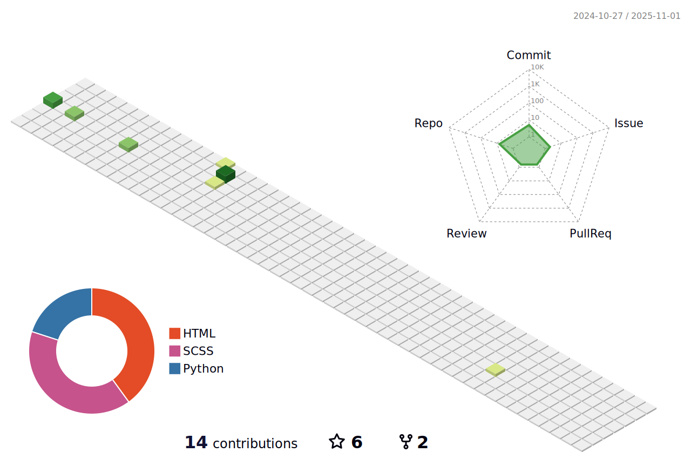

<!-- Heading -->
<h3 align="center"> Hi there! I'm Sky Chen</h3>

---

 <!-- About section -->
My name is Sky Chen and I'm a software developer/DevOps engineer. I'm from taiwan, living in taipei working at Chailease . You can find me on mail, or on LinkedIn.

 - 🔭 I'm currently working on maintaining [jsoning](https://github.com/khalby786/jsoning)!
 - 🌱 I'm currently learning Rust, TypeScript (again) and other cool stuff!
 <!-- - 👯 I'm looking to collaborate on full stack web apps! -->
 <!-- - 🤔 I'm looking for help with Typescript and React -->
 - 💬 Ask me about C#, 3D art (including voxel art), donuts and robots
 - 📫 How to reach me: 
      - [mail](ok96305@gmail.com)  
      - [other]()
 - 😄 Pronouns: he/him
 <!-- - ⚡ Fun fact: [object Object] -->

### &#x270d; Blog & Writing

<!-- Apart from coding, I also maintain a blog - you can find my articles on my website at [martinheinz.dev](https://martinheinz.dev/) as well as on [Medium](https://medium.com/@martin.heinz) and [DEV.to](https://dev.to/martinheinz). -->

A sample of my recent articles:

<!-- BLOG-POST-LIST:START -->
<!-- - [Getting Started with Mastodon API in Python](https://martinheinz.dev/blog/86)
- [Backup-and-Restore of Containers with Kubernetes Checkpointing API](https://martinheinz.dev/blog/85)
- [Getting Started with Google APIs in Python](https://martinheinz.dev/blog/84)
- [Python CLI Tricks That Don&#39;t Require Any Code Whatsoever](https://martinheinz.dev/blog/83)
BLOG-POST-LIST:END -->
<!-- About section: END -->

<!-- Conecct section -->

<h3>Connect with me </h3>
  

    
    
    
    
  

 <!-- Conecct section: END -->
 
  <!-- GitHub section -->

 ###  My GitHub Stats  
 

**Expand to view**

  
<b>⚡ GitHub Profile Stat</b>

  
   
    
   

  
<b>⚡ Recent GitHub Activity</b>

    

   
  

<!-- GitHub section: END -->

<!-- THE END -->